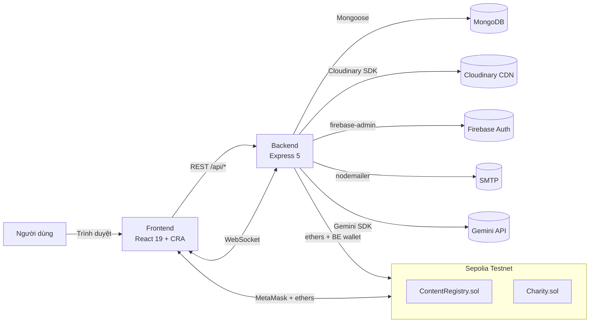
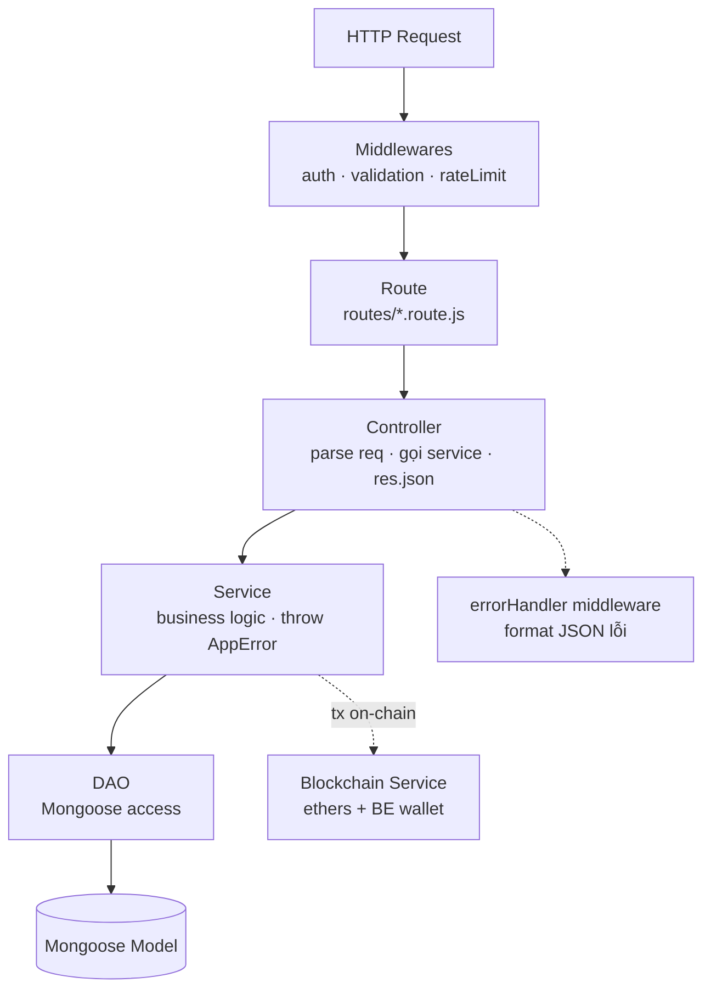
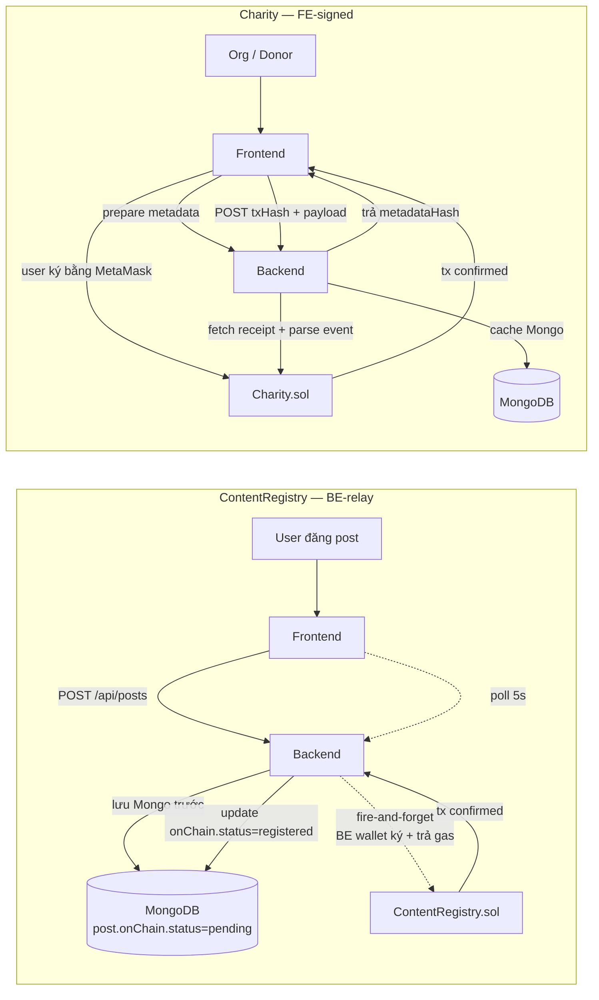

# SocialApp — Mạng xã hội MERN tích hợp Blockchain

> Đồ án môn học MERN (UIT HK2). Mạng xã hội full-stack lấy cảm hứng từ Facebook,
> bổ sung 2 tính năng Web3 chạy thật trên Sepolia testnet:
> **ContentRegistry** (đóng dấu bài đăng on-chain) và
> **Charity Donation** (gây quỹ minh bạch theo cột mốc).

---

## 1. Tổng quan

SocialApp gồm đầy đủ tính năng cốt lõi của một mạng xã hội (auth, feed, kết bạn,
chat realtime, story, group, notification, admin) **cộng thêm** một lớp blockchain
optional giúp:

- Người đăng bài có thể **chứng minh quyền tác giả** lên block Ethereum mà không
  phải tự trả gas (BE-relay pattern).
- Tổ chức từ thiện đã được verify có thể **mở campaign trên-chain với cột mốc**;
  donor góp ETH thẳng vào contract, admin chỉ có thể mở khoá tiền theo từng mốc
  thay vì cầm trọn quỹ.

App vẫn dùng được bình thường khi user **không có ví** — Web3 hoàn toàn optional.

### Tính năng chính

**Mạng xã hội**
- Đăng ký / đăng nhập (email + password, Google, hoặc ví Web3)
- Verify email, quên mật khẩu, đổi mật khẩu
- Feed cá nhân hoá (post của bạn bè + post từ group đã join)
- Đăng bài có ảnh / video, comment lồng nhau, like / unlike
- Kết bạn 2 chiều (request → accept), block user
- Chat realtime 1-1 và group chat (Socket.io), gọi voice peer-to-peer
- Story 24h, save bài viết
- Group / Community với role member/admin/owner
- Organization (tổ chức được verify), Communities tab gộp Group + Org
- Notification realtime (mention, like, comment, friend request, …)
- i18n vi/en, dark mode
- AI moderation cho post (Gemini, fail-open)
- Admin dashboard: quản lý user, post, organization, charity campaign

**Web3 (Sepolia testnet)**
- Wallet login (sign nonce với MetaMask thay password)
- ContentRegistry: bài đăng được đóng dấu on-chain, có badge "Verified" + nút "Verify on-chain"
- Charity Donation: tổ chức tạo campaign nhiều cột mốc, donor góp ETH, admin
  unlock từng mốc khi tổ chức nộp báo cáo; campaign hết hạn không đủ goal sẽ
  fail và donor claim refund được

---

## 2. Tech stack

| Tầng | Công nghệ |
|------|-----------|
| Frontend | React 19, react-router v7, axios, socket.io-client, ethers v6, i18next, react-hot-toast |
| Backend | Node.js, Express 5, Mongoose 8 (MongoDB), Socket.io, Cloudinary, Firebase Admin, JWT |
| Blockchain | Solidity 0.8.x, Hardhat, OpenZeppelin (AccessControl, ReentrancyGuard), ethers v6 |
| Realtime | Socket.io (chat, call, notification) |
| AI | Google Gemini API (post moderation) |
| Email | Nodemailer (SMTP Gmail) |
| Storage | Cloudinary (ảnh/video), MongoDB (data), Sepolia (on-chain proof) |
| Deploy | (Tự host VPS, domain `medicine.id.vn`) |

---

## 3. Kiến trúc tổng quan

### 3.1 Sơ đồ tổng



### 3.2 Backend — kiến trúc layered

Backend tuân theo `Controller → Service → DAO → Model`. Đa số module đã refactor
sang pattern này:



- Controller chỉ làm HTTP — không query Model.
- Service chứa business rule, throw `AppError(message, statusCode, details)`.
- DAO chỉ đụng Model. Counter (`postsCount`, `followersCount`, …) **bắt buộc** qua DAO method.
- Xem chi tiết trong [.claude/rules/architecture.md](.claude/rules/architecture.md) và [backend/README.md](backend/README.md).

### 3.3 Data flow Web3 — on-chain vs off-chain

Hai contract dùng **2 pattern khác nhau** vì ràng buộc về `msg.sender`:



| Pattern | Khi nào dùng | Ví dụ |
|---------|--------------|-------|
| **BE-relay** | User không cần ETH, attribution nhúng trong content hash | ContentRegistry (msg.sender = ví BE) |
| **FE-signed** | Contract enforce `msg.sender == beneficiary/donor` | Charity (org tự ký để contract nhận đúng beneficiary; donor tự ký để contract nhận đúng địa chỉ donor) |

Mọi tx thành công đều **cache vào Mongo** (off-chain mirror) — đọc chain chậm,
đọc Mongo nhanh, đối chiếu khi cần qua nút "Verify on-chain".

---

## 4. Cấu trúc monorepo

```
DoAn/
├── backend/               Express 5 + MongoDB + Socket.io + Cloudinary
│   ├── controllers/       HTTP layer
│   ├── services/          Business logic
│   ├── dao/               MongoDB access
│   ├── models/            Mongoose schemas
│   ├── routes/            *.route.js
│   ├── middlewares/       auth, validation, errorHandler, rateLimiter
│   ├── socket/            chatHandlers, callHandlers
│   ├── jobs/              cron (charityExpiryCron)
│   └── server.js          Entry
│
├── frontend/              React 19 (CRA) + react-router v7
│   ├── src/api/           Axios services (1 file / domain)
│   ├── src/contexts/      Auth, Socket, Theme, Web3
│   ├── src/pages/         Folder-per-page (.jsx + .css)
│   ├── src/components/    Folder-per-component
│   ├── src/hooks/         useForm, useVoiceCall, …
│   └── src/localization/  i18n vi + en
│
├── blockchain/            Hardhat
│   ├── contracts/         ContentRegistry.sol, Charity.sol
│   ├── test/              Solidity tests (40+ case Charity, có reentrancy mock)
│   └── scripts/           deploy.js
│
├── notes/                 Plan, session log, refactor TODO
├── .claude/               Skill, agent, rule cho Claude Code
└── CLAUDE.md              Hướng dẫn nội bộ cho AI assistant
```

---

## 5. Setup nhanh

Cần: **Node 18+**, **MongoDB** (local hoặc Atlas), **MetaMask** (cho Web3 optional),
**Sepolia ETH** từ faucet (cho deploy contract / test charity).

### 5.1 Clone và cài deps

```bash
git clone <repo>
cd DoAn

# 3 thư mục con đều npm install riêng
cd backend && npm install
cd ../frontend && npm install
cd ../blockchain && npm install
```

### 5.2 Env

Copy 3 file `.env.example` → `.env` và điền giá trị thật:

```bash
cp backend/.env.example backend/.env
cp frontend/.env.example frontend/.env
cp blockchain/.env.example blockchain/.env
```

Tối thiểu cho BE chạy được: `MONGODB_URI`, `JWT_SECRET`, `CLOUDINARY_*` (3 biến).
Thiếu là server exit ngay (xem [backend/server.js](backend/server.js#L14-L28)).

Xem chi tiết từng env: [backend/README.md](backend/README.md), [frontend/README.md](frontend/README.md).

### 5.3 Chạy dev

Mở 2 terminal:

```bash
# Terminal 1 — backend (port 5000)
cd backend && npm run dev

# Terminal 2 — frontend (port 3000)
cd frontend && npm start
```

Truy cập <http://localhost:3000>.

### 5.4 Blockchain (chỉ cần khi muốn deploy lại contract)

Hai contract đã deploy sẵn trên Sepolia, địa chỉ trong `backend/.env`. Nếu deploy lại:

```bash
cd blockchain
npx hardhat compile
npx hardhat test                                           # 40+ test case
npx hardhat run scripts/deploy.js --network sepolia        # cần SEPOLIA_RPC_URL + PRIVATE_KEY
```

---

## 6. Web3 — chi tiết

### 6.1 ContentRegistry (BE-relay)

**Mục đích:** chứng minh "bài này đã được người dùng X đăng vào lúc Y" mà
không phải tin server.

- BE ký + trả gas cho user — user **không cần** ETH để đăng bài.
- Vì `msg.sender` luôn là ví BE, attribution không thể dựa vào on-chain owner.
  Thay vào đó, `authorId` (userId Mongo) **được nhúng trong content hash**:
  `keccak256(JSON.stringify({ v: "v2", authorId, caption, image, video, createdAt }))`.
- Hash v1 (post legacy) không có `authorId` — chấp nhận tồn tại song song, không migrate.
- Pattern fire-and-forget: response trả ngay khi lưu Mongo; tx confirm ngầm,
  FE poll mỗi 5s/lần (max 12 lần) để cập nhật badge.

### 6.2 Charity (FE-signed)

**Mục đích:** gây quỹ minh bạch — donor không cần tin admin sẽ "không cầm tiền chạy",
vì admin chỉ unlock được tiền theo từng cột mốc đã công khai.

State machine:

```
OPEN ──(đủ goal trước hạn)──▶ FUNDED ──(admin markExecuting)──▶ EXECUTING
  │                                                                  │
  │                                                                  ▼
  │                                                    (unlock từng milestone)
  └──(hết hạn không đủ)──▶ FAILED ──(donor claimRefund)──▶ REFUNDED
                                                                     │
                                                                     ▼
                                                               COMPLETED
```

Quy tắc bảo vệ donor:
- **Min 2 milestone**, **max 50%/milestone** — chống pattern scam "1 mốc gom 100%".
- `sum(milestoneAmounts) === goal`, max 10 milestone, cố định sau khi tạo.
- Chỉ org đã được admin verify (whitelist on-chain qua `AccessControl`) mới tạo campaign được.
- `ReentrancyGuard` ở mọi function chuyển ETH; pull payment cho refund.
- Cron mỗi 30 phút auto-mark fail campaign hết hạn ([backend/jobs/charityExpiryCron.js](backend/jobs/charityExpiryCron.js)).

Pattern FE-signed bắt buộc vì contract enforce `beneficiary = msg.sender` —
BE relay sẽ làm beneficiary trỏ về ví BE (sai). 2-step API:
`POST /api/charity/campaigns/prepare` → org ký tx → `POST /api/charity/campaigns/record`.

Xem [blockchain/contracts/Charity.sol](blockchain/contracts/Charity.sol) và
[notes/11-charity-donation-plan.md](notes/11-charity-donation-plan.md).

---

## 7. Test

```bash
# Backend (Jest + supertest)
cd backend && npm test

# Blockchain (Hardhat)
cd blockchain && npx hardhat test
cd blockchain && REPORT_GAS=true npx hardhat test          # in báo cáo gas
```

Charity contract có **40+ test case**, bao gồm mock reentrancy attack
([blockchain/contracts/mocks/ReentrancyAttacker.sol](blockchain/contracts/mocks/ReentrancyAttacker.sol)).

---

## 8. Tài liệu chi tiết

- [backend/README.md](backend/README.md) — kiến trúc layered, danh sách API, env, convention BE
- [frontend/README.md](frontend/README.md) — page list, context, lazy route, env, convention FE
- [blockchain/README.md](blockchain/README.md) — contract design, deploy flow, địa chỉ Sepolia
- [CLAUDE.md](CLAUDE.md) — hướng dẫn cho Claude Code (rule, skill, agent)
- [notes/](notes/) — plan từng giai đoạn, session log, refactor TODO

---

## 9. Tác giả

**Nhan Nguyen** — Sinh viên UIT, môn MERN HK2.
Đồ án 1 thành viên, làm trong khoảng 4 tháng.

Báo cáo cuối kỳ: **2026-05-13**.
