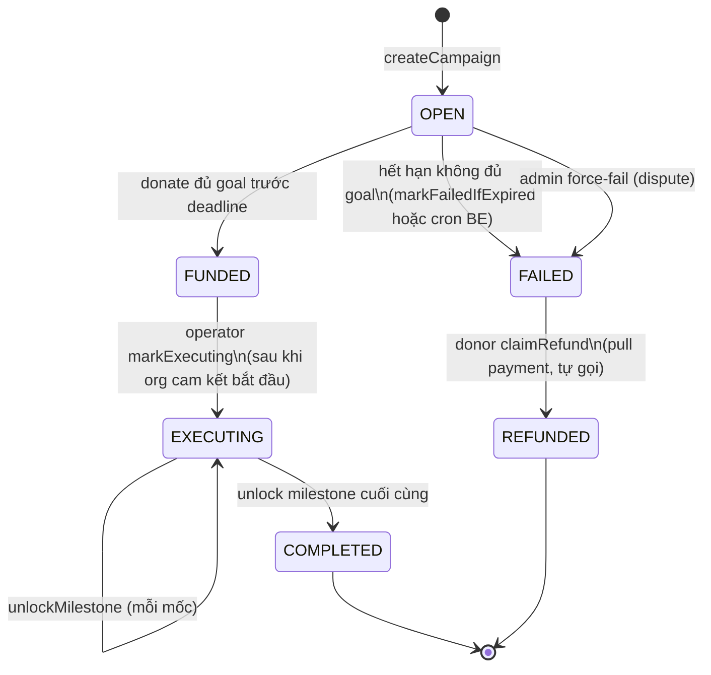

# Blockchain — SocialApp Smart Contracts

Hardhat project chứa 2 contract của SocialApp chạy trên **Sepolia testnet**:
**ContentRegistry** (đóng dấu bài đăng) và **Charity** (gây quỹ theo cột mốc).

> README tổng quan ở [../README.md](../README.md). Section "Web3" trong root đó
> giải thích vì sao lại có 2 contract này và pattern BE-relay vs FE-signed.

---

## 1. Tổng quan

| Contract | LOC | Pattern | Vai trò trong app |
|----------|-----|---------|-------------------|
| [ContentRegistry.sol](contracts/ContentRegistry.sol) | ~40 | **BE-relay** (BE trả gas, msg.sender = ví BE) | Lưu `(postId → bytes32 contentHash + owner + timestamp)` để chứng minh quyền tác giả |
| [Charity.sol](contracts/Charity.sol) | ~300 | **FE-signed** (org / donor tự ký) | State machine OPEN → FUNDED → EXECUTING → COMPLETED + nhánh FAILED → REFUNDED |

Ngoài ra có 1 mock dùng cho test:

- [contracts/mocks/ReentrancyAttacker.sol](contracts/mocks/ReentrancyAttacker.sol) — giả lập cuộc tấn công reentrancy vào `donate()` và `claimRefund()` của Charity.

---

## 2. Cấu trúc thư mục

```
blockchain/
├── contracts/
│   ├── ContentRegistry.sol      registerPost(postId, hash) + verifyPost(postId)
│   ├── Charity.sol              AccessControl + ReentrancyGuard + state machine
│   └── mocks/
│       └── ReentrancyAttacker.sol
├── test/
│   ├── Charity.test.js          40+ test case, có cả reentrancy attack
│   └── Lock.js                  (boilerplate Hardhat — bỏ qua)
├── scripts/
│   ├── deploy.js                Deploy ContentRegistry
│   ├── deploy-charity.js        Deploy Charity (có balance guard)
│   └── check-balance.js         Tiện ích check ETH ví BE trên Sepolia
├── hardhat.config.js            Solidity 0.8.24 + Sepolia + Etherscan verify
└── package.json
```

---

## 3. Setup

```bash
cd blockchain
npm install
```

Copy `.env.example` → `.env`:

```bash
cp .env.example .env
```

| Env | Bắt buộc | Ghi chú |
|-----|----------|---------|
| `SEPOLIA_RPC_URL` | có (khi deploy / test mainnet fork) | RPC Sepolia (Alchemy / Infura / Public node) |
| `PRIVATE_KEY` | có (khi deploy) | Ví BE để deploy. **Tuyệt đối không commit.** Cần ≥ 0.05 ETH Sepolia |
| `ETHERSCAN_API_KEY` | – | Cho `hardhat verify` để verify source code lên Etherscan |

> Test local (`npx hardhat test`) **không** cần env — Hardhat dùng in-process EVM với 20 account fake.

---

## 4. Compile / Test / Deploy

```bash
# Compile mọi contract → ./artifacts
npx hardhat compile

# Test local (in-process EVM)
npx hardhat test
REPORT_GAS=true npx hardhat test          # in báo cáo gas

# Coverage
npm run coverage

# Deploy
npx hardhat run scripts/deploy.js --network sepolia              # ContentRegistry
npx hardhat run scripts/deploy-charity.js --network sepolia      # Charity (kèm balance guard ≥ 0.05 ETH)

# Verify source code lên Etherscan
npx hardhat verify --network sepolia <address>                    # ContentRegistry (no constructor arg)
npx hardhat verify --network sepolia <address> <admin> <operator> # Charity

# Tiện ích
npx hardhat run scripts/check-balance.js --network sepolia        # in balance ví BE
```

Sau khi deploy, copy địa chỉ contract vào `backend/.env`
(`CONTENT_REGISTRY_ADDRESS`, `CHARITY_ADDRESS`) và `frontend/.env`
(`REACT_APP_CHARITY_ADDRESS`).

---

## 5. ContentRegistry

```solidity
function registerPost(string postId, bytes32 contentHash) public;
function verifyPost(string postId) public view returns (Post memory);

event PostRegistered(string postId, address owner, uint256 timestamp);
```

- Mỗi `postId` chỉ register được 1 lần (`require(!exists)`).
- Contract Solidity **không hiểu định dạng hash** — chỉ lưu opaque `bytes32`.
  Logic v1 / v2 hoàn toàn off-chain (BE quyết định công thức).
- BE relay: `msg.sender` = ví BE → owner on-chain không phải attribution thật.
  Attribution gắn vào hash:

```js
// Hash v2 (post mới — chống "scam copy register trước")
keccak256(JSON.stringify({
  v: "v2",
  authorId,        // userId Mongo của tác giả thật
  caption,
  image,
  video,
  createdAt,
}))

// Hash v1 (post legacy — vẫn verify được, không có authorId)
keccak256(JSON.stringify({ caption, image, video, createdAt }))
```

- Post cũ giữ `onChain.version = null` → BE auto-detect dùng công thức v1 khi
  verify. **Không migrate** post cũ.

Service tương ứng: [backend/services/contentRegistryService.js](../backend/services/contentRegistryService.js).

---

## 6. Charity

### 6.1 State machine



Mỗi transition đều có invariant kiểm tra ở Solidity (`require`).

### 6.2 Vai trò (AccessControl)

| Role | Ai cầm | Quyền |
|------|--------|-------|
| `DEFAULT_ADMIN_ROLE` | Ví admin (đồ án dùng chung ví BE) | Whitelist / unwhitelist org, force-fail campaign khi có dispute |
| `CAMPAIGN_CREATOR_ROLE` | Org đã được admin verify off-chain + whitelist on-chain | Gọi `createCampaign(...)` |
| `OPERATOR_ROLE` | Ví BE | `markExecuting`, `unlockMilestone` (sau khi admin duyệt báo cáo off-chain). **Không có quyền rút tiền.** |
| Donor (mọi địa chỉ) | – | `donate(campaignId)` payable, `claimRefund(campaignId)` khi FAILED |

### 6.3 Quy tắc bảo vệ donor (chống scam)

Hardcode trong contract (`require`), enforce thêm ở BE service và FE form:

| Rule | Hằng số contract | Lý do |
|------|------------------|-------|
| Min 2 milestone | `MIN_MILESTONES = 2` | Chống "1 mốc gom 100% goal" |
| Max 50% / milestone | `MAX_MILESTONE_PERCENT = 50` | Buộc có ít nhất 2 mốc thực sự, không lệch |
| Max 10 milestone | `MAX_MILESTONES = 10` | Tránh gas bomb khi unlock nhiều mốc |
| `sum(milestoneAmounts) === goal` | `require` | Tổng mốc phải đúng goal, không thừa thiếu |
| Pull refund | – | Donor tự `claimRefund` thay vì admin loop push → tránh reentrancy + out-of-gas |
| `ReentrancyGuard` | OZ modifier | Bọc `donate`, `unlockMilestone`, `claimRefund` |
| ETH native | `payable` | Chỉ nhận ETH, không ERC-20 (đơn giản hoá scope) |
| Off-chain metadata | `bytes32 metadataHash` | Title / description / image lưu Mongo, on-chain chỉ commit hash |

### 6.4 Tại sao FE-signed?

Contract `createCampaign` set `beneficiary = msg.sender` cứng:

```solidity
campaigns[id].beneficiary = msg.sender;
```

→ Nếu BE relay, beneficiary sẽ là ví BE (sai). Org **bắt buộc tự ký** bằng ví đã
được whitelist (trùng `org.walletAddress` trong Mongo).

Donate cũng FE-signed vì `contributions[id][msg.sender] += msg.value` —
contract phải nhận đúng địa chỉ donor để sau này refund đúng người.

API 2-step:

```
POST /api/charity/campaigns/prepare   → BE trả metadataHash + payload
[FE: org ký bằng MetaMask]            → tx confirmed
POST /api/charity/campaigns/record    → BE fetch receipt + parse event, cache Mongo
```

### 6.5 Cron job auto-fail

[backend/jobs/charityExpiryCron.js](../backend/jobs/charityExpiryCron.js) chạy
mỗi 30 phút (override `CHARITY_EXPIRY_CRON`), gọi `markFailedIfExpired(id)` cho
campaign `OPEN` đã quá deadline. Function này **public** — ai cũng gọi được, BE
gọi để chủ động chuyển state thay vì chờ donor click claim.

Service tương ứng: [backend/services/charityService.js](../backend/services/charityService.js).
Plan đầy đủ: [../notes/11-charity-donation-plan.md](../notes/11-charity-donation-plan.md).

---

## 7. Test

```bash
npx hardhat test
```

40+ test case ở [test/Charity.test.js](test/Charity.test.js) cover:

- Happy path: `OPEN → FUNDED → EXECUTING → COMPLETED` đầy đủ với 2-3 milestone.
- Sad path: `OPEN → FAILED → REFUNDED` (1 hoặc nhiều donor cùng claim).
- Boundary: donate đúng goal / vượt goal (refund phần thừa), donate khi đã FUNDED, deadline edge.
- Permission: non-creator gọi `createCampaign`, non-operator gọi `unlockMilestone`, non-admin force-fail.
- Validation: `sum != goal`, `milestones < 2`, `milestones > 10`, `1 mốc > 50% goal`.
- Reentrancy: dùng [ReentrancyAttacker.sol](contracts/mocks/ReentrancyAttacker.sol)
  với `try/catch` trong `receive()` để re-enter `donate()` / `claimRefund()` —
  contract phải revert/skip nhờ `ReentrancyGuard`.
- Idempotency: gọi `markFailedIfExpired` 2 lần không gây lỗi (chỉ chuyển state lần đầu).

Báo cáo gas:

```bash
REPORT_GAS=true npx hardhat test
```

---

## 8. Tiêu chí đánh giá (cho báo cáo)

Mỗi contract cần trả lời được 2 câu:

1. **Minh bạch — ai verify được điều gì?**
   - ContentRegistry: bất kỳ ai cũng verify được "post X có content hash Y vào lúc Z" mà không cần tin server.
   - Charity: bất kỳ ai cũng kiểm tra được tổng đã raise / đã unlock từng mốc / từng tx donate trên Etherscan.
2. **Hữu ích — giá trị thật so với Web2 thuần?**
   - ContentRegistry: chống case server bị hack / admin sửa post + đổi timestamp âm thầm.
   - Charity: donor không cần tin admin "không cầm tiền chạy" — admin chỉ unlock được tiền theo cột mốc đã công khai, hết hạn không đủ goal thì donor lấy lại được.

---

## 9. Liên kết

- [ContentRegistry.sol](contracts/ContentRegistry.sol)
- [Charity.sol](contracts/Charity.sol)
- [Charity.test.js](test/Charity.test.js)
- [backend/services/contentRegistryService.js](../backend/services/contentRegistryService.js)
- [backend/services/charityService.js](../backend/services/charityService.js)
- [notes/11-charity-donation-plan.md](../notes/11-charity-donation-plan.md)
- [../README.md](../README.md) — tổng quan project + sơ đồ data flow on-chain vs off-chain
